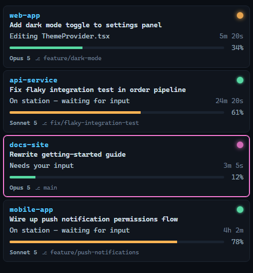

# Mission Control

A docked widget for keeping an eye on every running Claude Code CLI session across
every clone — clone name, session title (`/rename`), live context %, and what it's
currently doing (running a tool, thinking, waiting on you).

*(shown with placeholder demo data)*

## How it knows what's running

Two questions — *is this session alive* and *is it working or idle* — and neither is
answered by inference. Both used to be guessed from file timestamps, which is why the
board kept showing sessions that had already exited and sessions that were mid-turn as
"On station". Timestamps cannot tell those apart: a session deep in inference and a
session sitting at an empty prompt both write nothing.

- **Alive = the owning OS process is alive.** `~/.claude/hooks/session-state.js` runs
  on `SessionStart` and walks its own parent chain to find the `claude.exe` that owns
  the session, recording that PID in `~/.claude/state/<sessionId>.json`. The server
  checks it with `process.kill(pid, 0)` (instant) and cross-checks against a 15s-cached
  scan of real `claude.exe` PIDs (so a recycled PID can't impersonate a dead session).
  A closed terminal drops off the board on the next 2.5s poll — no staleness window.
- **State = Claude Code says so.** The same hook fires on `UserPromptSubmit` →
  `working`, `Stop` → `idle`, `Notification` → `needs-input`, `SessionEnd` → the state
  and heartbeat files are deleted. Four low-frequency events per turn, never per tool
  call, so there is no latency cost. `SessionStart` with `source: compact` deliberately
  preserves the previous state — compaction restarts a session mid-turn.
- `~/.claude/status/<sessionId>.json` — a heartbeat written every 10s by
  `~/.claude/statusline.sh` (a small global addition, see below). It carries the exact
  numbers Claude Code computes — context `used_percentage`, `session_name` (the
  `/rename` title), model, rate limits, cost — and is **no longer a liveness signal**.
  It only backs up liveness for sessions that predate the hook.
- `~/.claude/projects/**/*.jsonl` — the transcript tail, now **cosmetic only**: the
  "Reading foo.ts" label and the git branch. It never decides whether a session is live
  or what state it is in. It is parsed straight from the hook-declared state, cached by
  mtime, and if a new record type shows up it can at worst make a label vague.
- Clone name is `workspace.project_dir` from the heartbeat (the clone root as Claude
  Code recorded it at launch) — not raw `cwd`, which drifts if the assistant `cd`s into
  a subfolder mid-session.

A session that started before the hook existed has no state file. It falls back to
heartbeat freshness for liveness and to the transcript's turn edges (last real user
prompt vs. last turn-end marker) for state. That path closes the moment the session is
restarted; `tracked: false` on the API marks the ones still on it.

## Layout

- `src/sessions.js` — scans, correlates heartbeat + transcript tail, derives activity.
- `src/server.js` — dependency-free Node HTTP server (port 4174): `/api/sessions`,
  `/panel`.
- `public/panel.html` — the widget UI itself (vanilla HTML/CSS/JS, polls every 2.5s).
- `host/` — .NET WPF app (`MissionControl.csproj`, .NET 10): frameless, draggable,
  always-on-top-toggleable WebView2 window docked on screen, tray icon (color-coded to
  fleet state), spawns/owns the Node server.

## Running

- `npm run serve` — server only, widget at http://127.0.0.1:4174/panel.
- Full widget: `dotnet build host/MissionControl.csproj -c Release`, then run the built
  `MissionControl.exe`. Tray menu: always-on-top toggle, start-with-Windows toggle,
  open in browser, refresh, quit.

## Local config

Copy `mission-control.config.example.json` to `mission-control.config.json` (gitignored) to
override the defaults for your own machine:

- `excludeCwdSubstrings` — session `cwd`/transcript-path substrings to hide from the board.
- `cloneOrder` — explicit clone display order; if empty, clones are grouped by their own
  most-recent activity instead.
- `surfaceNames` — maps a `cwd` substring to a display label; unused by mission-control
  itself today, reserved for whenever it calls into the `claude-scraper` dependency.

## The global hooks

`hooks/session-state.js` in this repo is the canonical source for the global hook;
`~/.claude/hooks/session-state.js` is a deployed copy and must be kept in sync by hand
(no symlink — Windows symlinks need elevation). `~/.claude/settings.json` registers it
on `SessionStart`, `UserPromptSubmit`, `Stop`, `Notification`, `SessionEnd`, and
`PreToolUse`. It is additive alongside the existing hooks on those events, writes only
to `~/.claude/state/`, prints nothing (stdout on `UserPromptSubmit` would be injected as
context), and swallows every error — a monitoring hook must never break the turn it
observes. The one non-trivial cost, the parent-chain walk that finds the owning PID, is
paid once per session and cached in the state file. It has no dependencies beyond Node
built-ins (`fs`, `os`, `path`, `child_process`).

`PreToolUse` fires once per tool call — far more often than the other five events — so
it exists solely to recover from `needs-input`: `Notification` sets that state on a
blocking prompt (`permission_prompt` / `elicitation_dialog`), but Claude Code doesn't
reliably fire another `Notification` once the prompt is answered and tool calls resume,
which used to leave the board showing a session as blocked long after it had gone back
to working. The next `PreToolUse` is the earliest signal that happened, so it clears
`needs-input` → `working`. To keep the added frequency cheap, the hook skips the disk
write entirely when `PreToolUse` doesn't change the state (the common case — mid-turn
tool calls while already `working`), so the extra cost is paid only at the one moment it
matters.

## The statusline.sh addition

`~/.claude/statusline.sh` (global, applies to every Claude Code session on this
machine) gained a few lines at the top: it now also writes the JSON payload Claude
Code feeds it to `~/.claude/status/<session_id>.json`, atomically, on every refresh.
Purely additive — the visible statusline output is unchanged.
